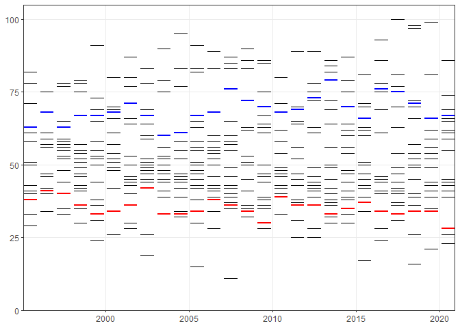

English Premier League
================

How many points do you need to

1.  avoid relegation, and
2.  qualify for Champions League?

``` r
library(tidyverse)
```

We’ll be using [English Premier League
data](https://github.com/Cervus1983/EPL-data/blob/master/index.md):

``` r
epl
```

    ## # A tibble: 10,804 x 6
    ##    Season Date     HomeTeam         AwayTeam        FTHG  FTAG
    ##     <int> <chr>    <chr>            <chr>          <dbl> <dbl>
    ##  1   1993 14/08/93 Arsenal          Coventry           0     3
    ##  2   1993 14/08/93 Aston Villa      QPR                4     1
    ##  3   1993 14/08/93 Chelsea          Blackburn          1     2
    ##  4   1993 14/08/93 Liverpool        Sheffield Weds     2     0
    ##  5   1993 14/08/93 Man City         Leeds              1     1
    ##  6   1993 14/08/93 Newcastle        Tottenham          0     1
    ##  7   1993 14/08/93 Oldham           Ipswich            0     3
    ##  8   1993 14/08/93 Sheffield United Swindon            3     1
    ##  9   1993 14/08/93 Southampton      Everton            0     2
    ## 10   1993 14/08/93 West Ham         Wimbledon          0     2
    ## # ... with 10,794 more rows

…and
[league\_table](https://github.com/Cervus1983/EPL-table/blob/master/index.md)
function:

``` r
epl %>% 
    filter(
        Season == 2020
    ) %>% 
    league_table() %>% 
    print.data.frame(
        row.names = FALSE
    )
```

    ##  Pos             Team Pts GF GA
    ##    1         Man City  86 83 32
    ##    2       Man United  74 73 44
    ##    3        Liverpool  69 68 42
    ##    4          Chelsea  67 58 36
    ##    5        Leicester  66 68 50
    ##    6         West Ham  65 62 47
    ##    7        Tottenham  62 68 45
    ##    8          Arsenal  61 55 39
    ##    9            Leeds  59 62 54
    ##   10          Everton  59 47 48
    ##   11      Aston Villa  55 55 46
    ##   12        Newcastle  45 46 62
    ##   13           Wolves  45 36 52
    ##   14   Crystal Palace  44 41 66
    ##   15      Southampton  43 47 68
    ##   16         Brighton  41 40 46
    ##   17          Burnley  39 33 55
    ##   18           Fulham  28 27 53
    ##   19        West Brom  26 35 76
    ##   20 Sheffield United  23 20 63

The questions we want to answer:

-   How many points does it take to finish in the top four ([to qualify
    for Champions
    League](https://en.wikipedia.org/wiki/Premier_League#%22Top_Four%22_dominance_(2000s)))?
-   How many points does it take to avoid relegation, i.e. finish above
    18th place?

Note that the first two seasons had 22 clubs competing, down to 20 from
1995 onwards, and we won’t include them in the analysis:

``` r
epl %>% 
    count(
        Season
    )
```

    ## # A tibble: 28 x 2
    ##    Season     n
    ##     <int> <int>
    ##  1   1993   462
    ##  2   1994   462
    ##  3   1995   380
    ##  4   1996   380
    ##  5   1997   380
    ##  6   1998   380
    ##  7   1999   380
    ##  8   2000   380
    ##  9   2001   380
    ## 10   2002   380
    ## # ... with 18 more rows

Let’s put all league tables for every season from 1995/96 through
2020/21 into a data frame:

``` r
lt <- epl %>% 
    filter(
        Season %in% 1995:2020
    ) %>% 
    group_by(
        Season
    ) %>% 
    group_nest() %>% 
    mutate_at(
        vars(data),
        map,
        league_table
    ) %>% 
    unnest(
        cols = data
    )
```

Let’s plot points vs table position, highlighting <span
style="color: blue">4th</span> (Champions League) and <span
style="color: red">18th</span> (relegation) positions:

``` r
ggplot(
    mapping = aes(
        x = Season + .1,
        y = Pts,
        xend = Season + .9,
        yend = Pts
    )
) +
    geom_segment(
        data = lt
    ) +
    geom_segment(
        data = filter(
            lt,
            Pos == 4
        ),
        colour = "blue",
        size = 1
    ) +
    geom_segment(
        data = filter(
            lt,
            Pos == 18
        ),
        colour = "red",
        size = 1
    ) +
    labs(
        x = NULL,
        y = NULL
    ) +
    scale_x_continuous(
        expand = expansion()
    ) +
    scale_y_continuous(
        expand = expansion(
            mult = c(0, .05)
        ),
        limits = c(0, NA)
    ) +
    theme_bw() +
    theme(
        panel.grid.minor = element_blank()
    )
```

<!-- -->

The range of points that were required to get into Top 4:

``` r
lt %>% 
    filter(
        Pos == 4
    ) %>% 
    pull(
        Pts
    ) %>% 
    range()
```

    ## [1] 60 79

…to avoid relegation:

``` r
lt %>% 
    filter(
        Pos == 18
    ) %>% 
    pull(
        Pts
    ) %>% 
    range()
```

    ## [1] 28 42
